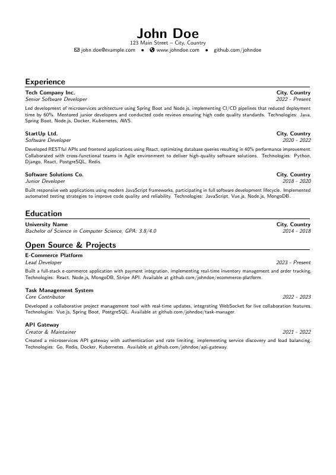

# Vlad Skarzhevskyy

Software developer with expertise in modern technologies and development practices.

- 📧 Email: [vlad@skarzhevskyy.com](mailto:vlad@skarzhevskyy.com)
- 💼 LinkedIn: [linkedin.com/in/vlad-skarzhevskyy](https://www.linkedin.com/in/vlad-skarzhevskyy/)
- 🐙 GitHub: [github.com/skarzhevskyy](https://github.com/skarzhevskyy)
- 🌐 Website: [skarzhevskyy.com](https://skarzhevskyy.com)
- 📄 CV: [Download PDF](src/resume.pdf)

📄 **[Download Full CV (PDF)](src/resume.pdf)**

---

## 🛠️ DIY - Create Your Own CV

Want to create a similar professional LaTeX CV?

**Quick Start:** See [README-TLDR.md](README-TLDR.md) for a 3-step guide.

### License

This template is based on the moderncv package, distributed under the LaTeX Project Public License (LPPL) version 1.3c.
